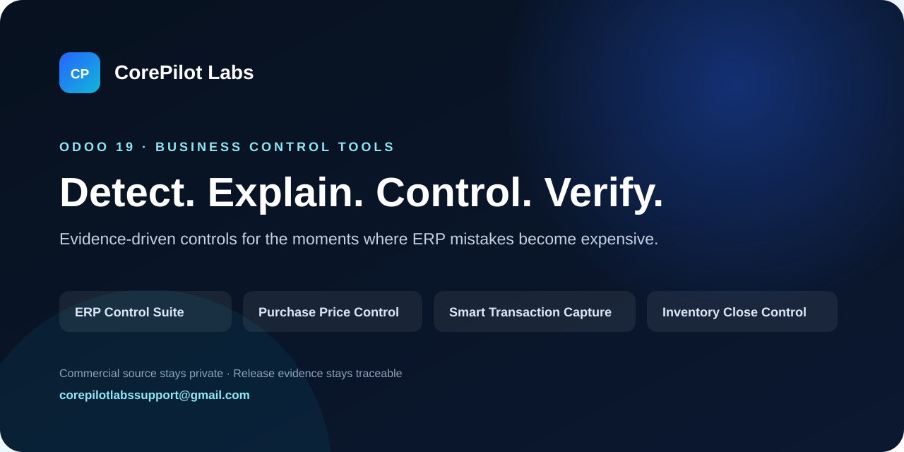

# CorePilot Labs — Odoo 18 Business Control Apps

**Detect the problem → understand the evidence → decide with control → verify the result.**

CorePilot Labs builds focused **Odoo 18** business-control applications around recurring ERP, accounting and procurement problems. The goal is not to add more screens. The goal is to help users detect problems earlier, understand why they happened, and move toward a controlled result with evidence and traceability.

## The three Odoo 18 applications

| Product | Business problem | What it adds |
|---|---|---|
| [ERP Control Center](products/erp-control-suite.md) | “Something is wrong in Odoo — where is the cause?” | Structured inspection, diagnosis, evidence, controlled remediation and verification |
| [Purchase Price Control](products/purchase-price-control.md) | Purchase prices increase without enough context before approval | Historical price comparison, vendor intelligence, variance alerts and approval control |
| [Smart Transaction Capture](products/smart-transaction-capture.md) | Invoice/PDF/image entry is slow and OCR can create unchecked errors | Controlled extraction, confidence checks, duplicate detection, validation and draft creation |

## Why this product line exists

Most ERP problems are not caused by the absence of another dashboard. They happen because the user sees the symptom too late, does not have enough evidence to understand the cause, or executes a correction without a reliable verification step.

CorePilot uses a stronger operating pattern:

**Detect → Explain → Evidence → Review / Dry Run → Approval → Execute → Verify**

Read-only diagnostics stay simple. Sensitive accounting or operational actions require stronger controls when the risk justifies them.

## Start from the problem

- [How to detect purchase-price increases before approval](use-cases/odoo-purchase-price-increase-control.md)
- [Why invoice OCR needs validation before accounting entry](use-cases/odoo-invoice-ocr-validation.md)
- [How to diagnose accounting and ERP issues systematically](use-cases/odoo-accounting-diagnostics-control.md)

## Built for Odoo 18 teams

The public campaign is focused on **Odoo 18** users, finance teams, accountants, procurement teams, controllers, Odoo implementers and businesses that want stronger control without replacing Odoo.

The commercial source code remains private. This repository is the public product showroom: product explanations, use cases, support routes, safety principles and buyer-facing documentation.

## Public pages

- [English product showroom](index.html)
- [واجهة المنتجات بالعربية](ar.html)
- [Buyer FAQ](FAQ.md)
- [Support](SUPPORT.md)
- [Security](SECURITY.md)

## Have a recurring Odoo problem?

If a capability is missing, describe the **business problem and the result you need**. We first check whether Odoo already supports it, whether configuration can solve it, or whether a focused product/customization is justified.

- Public, non-sensitive ideas: [GitHub Issues](https://github.com/corepilotlabs/odoo18-business-apps/issues)
- Product and commercial inquiries: **corepilotlabssupport@gmail.com**

> Do not post customer data, credentials, invoices, database exports or security-sensitive information in public issues.

---

**CorePilot Labs** · Odoo 18 business-control applications · Commercial source stays private
